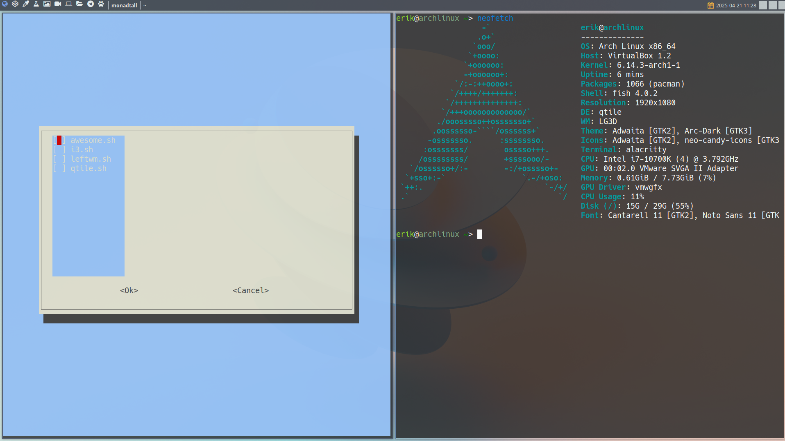

<h1 align="center">
 
   
   ArcoLinux Nemesis
</h1>

&nbsp;&nbsp;&nbsp;&nbsp;

&nbsp;&nbsp;

# ArcoLinux Nemesis

Renaming isn’t feasible, as these scripts have been referenced thousands of times over the years. However, they could ideally be called **Linux Nemesis scripts** since they apply to any Linux-based system.

## What to Do After Installing the Latest Version of ArcoLinux?

The goal of these scripts is to give you control over your operating system by allowing you to:

- Remove packages
- Install packages
- Use ArcoLinux configurations, applications and settings on any system
- Apply your personal preferences and configurations on any setup
- Build and use Chadwm (a fork of dwm, a tiling window manager) on any distribution

## Distributions/ISOs supported

Over time this script to tweak ArcoLinux evolved and can now setup the following distributions and more:

Arch Linux based distros

- [Alci](https://alci.online)
- [Arch Linux](https://archlinux.org/download/)
- [ArchBang](https://archbang.org)
- [Archcraft](https://archcraft.io)
- [Archman](https://archman.org)
- [Area](https://ariser.eu)
- [Ariser](https://ariser.eu)
- [Artix](https://artixlinux.org/)
- [Big Linux](https://www.biglinux.com.br)
- [Bluestar Linux](https://sourceforge.net/projects/bluestarlinux/)
- [Cachyos](https://cachyos.org/)
- [Carli](https://www.arcolinuxiso.com)
- [Crystal Linux](https://getcryst.al/)
- [EndeavourOS](https://endeavouros.com)
- [Liya](https://sourceforge.net/projects/liya-2024/)
- [Mabox](https://maboxlinux.org/)
- [Manjaro](https://manjaro.org)
- [Parchlinux](https://parchlinux.com/)
- [RebornOS](https://rebornos.org)
- [Sierra](https://ariser.eu)
- [StormOS](https://sourceforge.net/projects/hackman-linux/)

Many videos about these distros are available on our youtube channel

>https://www.youtube.com/erikdubois

Non Arch based distros

| Distribution   | Examples                                           | Videos                                         |
|----------------|----------------------------------------------------|------------------------------------------------|
| [Alma Linux](https://almalinux.org)    | [Examples](https://github.com/erikdubois/almalinux-chadwm) | [YouTube Playlist](https://www.youtube.com/playlist?list=PLlloYVGq5pS4ynJaMtZgpmUZ35i0EvmJS) |
| [AnduinOS](https://www.anduinos.com)    | [Examples](https://github.com/erikdubois/anduin-chadwm) | [YouTube Playlist](https://www.youtube.com/playlist?list=PLlloYVGq5pS4ynJaMtZgpmUZ35i0EvmJS) |
| [Debian](https://www.debian.org)     | [Examples](https://github.com/erikdubois/debian-chadwm)  | [YouTube Playlist](https://www.youtube.com/playlist?list=PLlloYVGq5pS5KExtV-n0g_I6Ei0963scq)     |
| [Fedora](https://fedoraproject.org)         |  [Examples](https://github.com/erikdubois/fedora-chadwm) | [YouTube Playlist](https://www.youtube.com/playlist?list=PLlloYVGq5pS7_l5LFkHkbxLwttgd3m12D)    |
| [Freebsd](https://fedoraproject.org)         |  [Examples](https://github.com/erikdubois/freebsd-chadwm) | [YouTube Playlist](https://www.youtube.com/playlist?list=PLlloYVGq5pS7_l5LFkHkbxLwttgd3m12D)    |
| [Linux Mint](https://www.linuxmint.com)         | [Examples](https://github.com/erikdubois/mint-chadwm)       | [YouTube Playlist](https://www.youtube.com/playlist?list=PLlloYVGq5pS4dMHsRIx6RAfbLNNMOEdCM) |
| [LMDE 6](https://www.linuxmint.com)         |   [Examples](https://github.com/erikdubois/lmde-chadwm)    | [YouTube Playlist](https://www.youtube.com/playlist?list=PLlloYVGq5pS4dYYxaBFQpZsT5v0XbNfZw) |
| [MX Linux](https://mxlinux.org)         |  [Examples](https://github.com/erikdubois/mxlinux-chadwm)  | [YouTube Playlist](https://www.youtube.com/playlist?list=PLlloYVGq5pS4taYXROH0eMFV0olfWF8w0) |
| [Nobara](https://nobaraproject.org)         |  [Examples](https://github.com/erikdubois/nobara-chadwm)      | [YouTube Playlist](https://www.youtube.com/playlist?list=PLlloYVGq5pS7O1qeZj5D3E4vmqNz26zsq) |
| [Peppermint](https://peppermintos.com)         |    [Examples](https://github.com/erikdubois/peppermint-chadwm)    | [YouTube Playlist](https://www.youtube.com/playlist?list=PLlloYVGq5pS4ezKAHvmk51lQz1ooGnLID) |
| [PopOS](https://pop.system76.com)         |    [Examples](https://github.com/erikdubois/popos-chadwm)    | [YouTube Playlist](https://www.youtube.com/playlist?list=PLlloYVGq5pS7_pd0itZIIMNBUMd7aHLaI) |
| [Solus](https://getsol.us/download/)         |   [Examples](https://github.com/erikdubois/solus-chadwm)     | [YouTube Playlist](https://www.youtube.com/playlist?list=PLlloYVGq5pS4bPmu45gzgKMYEfrcL5yeP) |
| [Ubuntu](https://ubuntu.com/download)         |[Examples](https://github.com/erikdubois/ubuntu-chadwm) | [YouTube Playlist](https://www.youtube.com/playlist?list=PLlloYVGq5pS5OoJJI03yCinWaxpBg4Y_8) |
| [Void](https://voidlinux.org)         |   [Examples](https://github.com/erikdubois/void-chadwm)     | [YouTube Playlist](https://www.youtube.com/playlist?list=PLlloYVGq5pS4fX0vmGGk-kdi0NCDZsqXP) |

The scripts for Nixos are on a seperate github - https://github.com/erikdubois/nixos-configurations

## Workflow

I run `0-current-choices.sh` to handle everything automatically — removing unwanted packages, installing the ones I need, and setting up all my personal preferences, including Chadwm as my tiling window manager.

>Bottom line: choose any Linux system you prefer and stay in control with these scripts.

Stay safe, learn, have fun, and enjoy the experience!

# Arcolinux keys for anything Arch Linux based

Get the keys and mirrors from ArcoLinux so you can **install our packages via pacman**

The ArcoLinux repos are added to your /etc/pacman.conf if you run below script.

`wget bit.ly/get-arcolinux-keys && chmod +x ./get-arcolinux-keys && sudo ./get-arcolinux-keys`

If you got the keys and mirrors from ArcoLinux. You can install  any package. 
For example the <b>Archlinux Tweak Tool or ATT</b>

Update your system and install the ATT or anything else via pacman.

`sudo pacman -Syyu`

`sudo pacman -Syu archlinux-tweak-tool-git`

# ArchLinux Tweak Tool

Or you can install the ATT from the **AUR**

`yay archlinux tweak`

`paru archlinux tweak`

Select the correct number and install it

You can get the keys and mirrors in via the ATT in the tab pacman

You can find all information about the ATT here

https://github.com/arcolinux/archlinux-tweak-tool

# Watch the videos on ATT

https://www.youtube.com/playlist?list=PLlloYVGq5pS5nvFc_LYRE82Gh3XWA6rVH

# Watch the videos on the Arcolinux Nemesis scripts

https://www.youtube.com/playlist?list=PLlloYVGq5pS7JqJE1zGS6W2jNV_oBSJCk

# Desktop Environment Examples

These scripts can be used with various window managers and desktop environments.

  
  
  
  
  

# Social Media

Youtube  : https://www.youtube.com/erikdubois