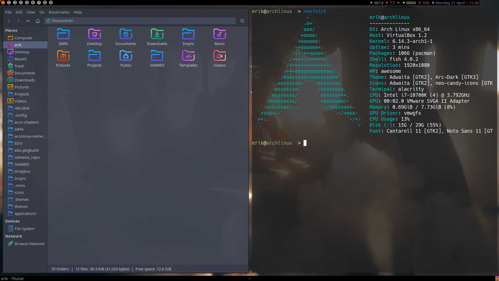
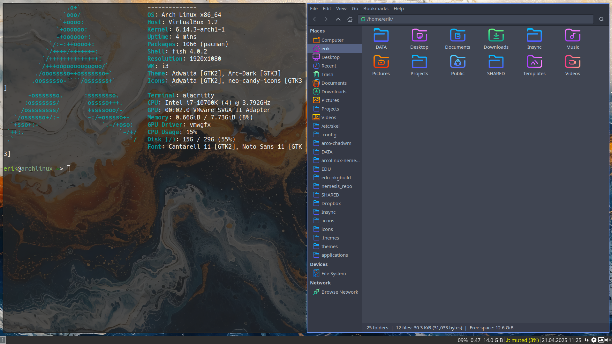
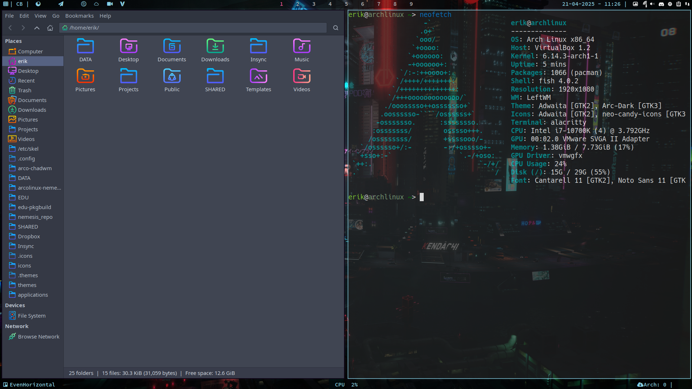
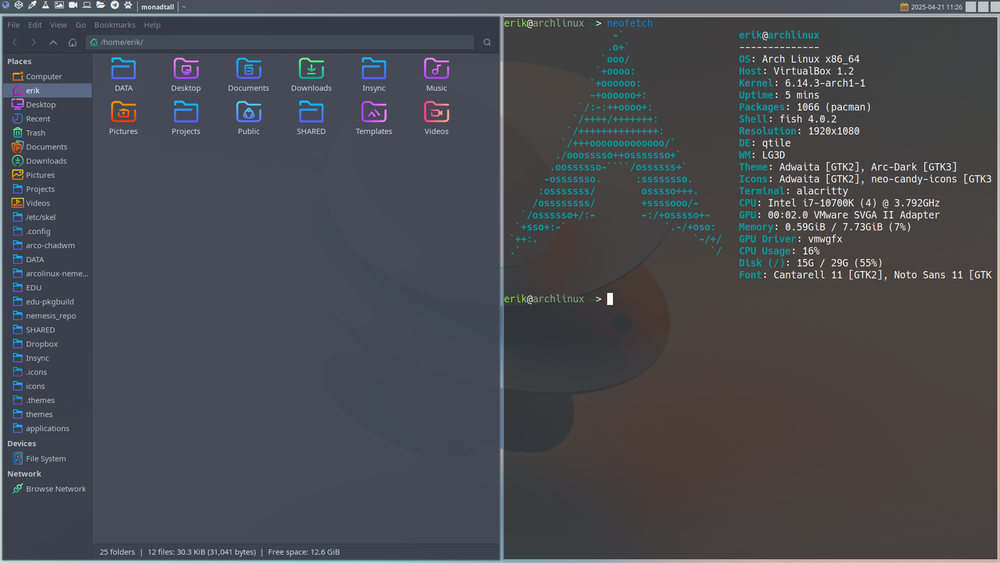
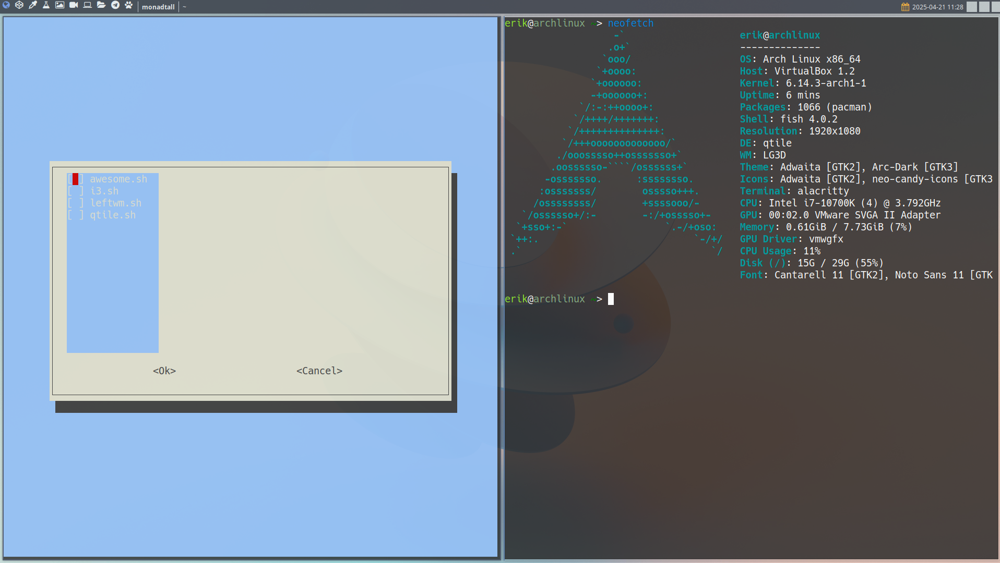
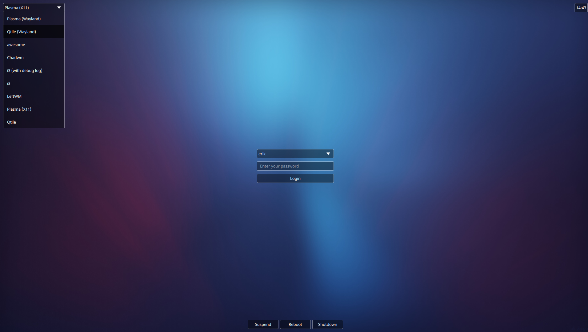

<h1 align="center">
 
  <br />
   ArcoLinux Nemesis
</h1>


&nbsp;&nbsp;&nbsp;&nbsp;

&nbsp;&nbsp;


# ArcoLinux Nemesis

Renaming isn’t feasible, as these scripts have been referenced thousands of times over the years. However, they could ideally be called **Linux Nemesis scripts** since they apply to any Linux-based system.
[](https://youtu.be/pk50vtZZSfI)

Learn, have fun and enjoy.

We will add the nemesis_repo to your /etc/pacman.conf and make a backup of the current config.

```
[nemesis_repo]
SigLevel = Never
Server = https://erikdubois.github.io/$repo/$arch
```

## Watch this video

[](https://youtu.be/guHmlOP0MQo)


## What to Do After Installing the Latest Version of ArcoLinux/Arch Linux?

The goal of these scripts is to give you control over your operating system by allowing you to:

- Remove packages
- Install packages
- Use ArcoLinux configurations, applications and settings on any system
- Apply your personal preferences and configurations on any setup
- Build and use Chadwm (a fork of dwm, a tiling window manager) on any distribution

## Distributions/ISOs supported

Over time this script to tweak ArcoLinux evolved and can now setup the following distributions and more:

Arch Linux based distros

- [Alci](https://alci.online)
- [Arch Linux](https://archlinux.org/download/)
- [ArchBang](https://archbang.org)
- [Archcraft](https://archcraft.io)
- [Archman](https://archman.org)
- [Arcris](https://sourceforge.net/projects/arcrisgui/)
- [Area](https://ariser.eu)
- [Ariser](https://ariser.eu)
- [Artix](https://artixlinux.org/)
- [BerserkerOS](https://berserkarch.xyz/)
- [Big Linux](https://www.biglinux.com.br)
- [BlendOS](https://blendos.co)
- [Bluestar Linux](https://sourceforge.net/projects/bluestarlinux/)
- [Cachyos](https://cachyos.org/)
- [Carli](https://www.arcolinuxiso.com)
- [Crystal Linux](https://getcryst.al/)
- [EndeavourOS](https://endeavouros.com)
- [Liya](https://sourceforge.net/projects/liya-2024/)
- [LinuxHub Prime](https://linuxhub.link/)
- [Mabox](https://maboxlinux.org/)
- [Manjaro](https://manjaro.org)
- [Nyarch](https://nyarchlinux.moe/)
- [Omarchy](https://omarchy.org)
- [Parchlinux](https://parchlinux.com/)
- [PrismLinux](https://www.prismlinux.org/)
- [RebornOS](https://rebornos.org)
- [Sierra](https://ariser.eu)
- [StormOS](https://sourceforge.net/projects/hackman-linux/)

Many videos about these distros are available on our youtube channel

>https://www.youtube.com/erikdubois


Non Arch based distros

| Distribution   | Examples                                           | Videos                                         |
|----------------|----------------------------------------------------|------------------------------------------------|
| [Alma Linux](https://almalinux.org)    | [Examples](https://github.com/erikdubois/almalinux-chadwm) | [YouTube Playlist](https://www.youtube.com/playlist?list=PLlloYVGq5pS4ynJaMtZgpmUZ35i0EvmJS) |
| [AnduinOS](https://www.anduinos.com)    | [Examples](https://github.com/erikdubois/anduin-chadwm) | [YouTube Playlist](https://www.youtube.com/playlist?list=PLlloYVGq5pS5AHcaaGldp0m9qid6Qx0Fz) |
| [Debian](https://www.debian.org)     | [Examples](https://github.com/erikdubois/debian-chadwm)  | [YouTube Playlist](https://www.youtube.com/playlist?list=PLlloYVGq5pS5KExtV-n0g_I6Ei0963scq)     |
| [Fedora](https://fedoraproject.org)         |  [Examples](https://github.com/erikdubois/fedora-chadwm) | [YouTube Playlist](https://www.youtube.com/playlist?list=PLlloYVGq5pS7_l5LFkHkbxLwttgd3m12D)    |
| [Freebsd](https://www.freebsd.org)         |  [Examples](https://github.com/erikdubois/freebsd-chadwm) | [YouTube Playlist](https://www.youtube.com/playlist?list=PLlloYVGq5pS7B6yd9tj3d_XLgWCg4phwZ)    |
| [Linux Mint](https://www.linuxmint.com)         | [Examples](https://github.com/erikdubois/mint-chadwm)       | [YouTube Playlist](https://www.youtube.com/playlist?list=PLlloYVGq5pS4dMHsRIx6RAfbLNNMOEdCM) |
| [LMDE 6](https://www.linuxmint.com)         |   [Examples](https://github.com/erikdubois/lmde-chadwm)    | [YouTube Playlist](https://www.youtube.com/playlist?list=PLlloYVGq5pS4dYYxaBFQpZsT5v0XbNfZw) |
| [MX Linux](https://mxlinux.org)         |  [Examples](https://github.com/erikdubois/mxlinux-chadwm)  | [YouTube Playlist](https://www.youtube.com/playlist?list=PLlloYVGq5pS4taYXROH0eMFV0olfWF8w0) |
| [Nobara](https://nobaraproject.org)         |  [Examples](https://github.com/erikdubois/nobara-chadwm)      | [YouTube Playlist](https://www.youtube.com/playlist?list=PLlloYVGq5pS7O1qeZj5D3E4vmqNz26zsq) |
| [Peppermint](https://peppermintos.com)         |    [Examples](https://github.com/erikdubois/peppermint-chadwm)    | [YouTube Playlist](https://www.youtube.com/playlist?list=PLlloYVGq5pS4ezKAHvmk51lQz1ooGnLID) |
| [PopOS](https://pop.system76.com)         |    [Examples](https://github.com/erikdubois/popos-chadwm)    | [YouTube Playlist](https://www.youtube.com/playlist?list=PLlloYVGq5pS7_pd0itZIIMNBUMd7aHLaI) |
| [Solus](https://getsol.us/download/)         |   [Examples](https://github.com/erikdubois/solus-chadwm)     | [YouTube Playlist](https://www.youtube.com/playlist?list=PLlloYVGq5pS4bPmu45gzgKMYEfrcL5yeP) |
| [Ubuntu](https://ubuntu.com/download)         |[Examples](https://github.com/erikdubois/ubuntu-chadwm) | [YouTube Playlist](https://www.youtube.com/playlist?list=PLlloYVGq5pS5OoJJI03yCinWaxpBg4Y_8) |
| [Void](https://voidlinux.org)         |   [Examples](https://github.com/erikdubois/void-chadwm)     | [YouTube Playlist](https://www.youtube.com/playlist?list=PLlloYVGq5pS4fX0vmGGk-kdi0NCDZsqXP) |

The scripts for Nixos are on a seperate github - https://github.com/erikdubois/nixos-configurations

## Workflow

I run `0-current-choices.sh` to handle everything automatically — removing unwanted packages, installing the ones I need, and setting up all my personal preferences, including Chadwm as my tiling window manager.

>Bottom line: choose any Linux system you prefer and stay in control with these scripts.

Stay safe, learn, have fun, and enjoy the experience!


# Watch the videos on the Arcolinux Nemesis scripts

https://www.youtube.com/playlist?list=PLlloYVGq5pS7JqJE1zGS6W2jNV_oBSJCk


# Desktop Environment Examples

These scripts can be used with various window managers and desktop environments.

E.g.: awesome, i3, leftwm, qtile, ...

<p align="center">
  
</p>

<p align="center">
  
</p>

<p align="center">
  
</p>

<p align="center">
  
</p>

<p align="center">
  
</p>

<p align="center">
  
</p>

# Social Media

Youtube  : https://www.youtube.com/erikdubois

Github : https://github.com/erikdubois

Website : https://erikdubois.be


# ArcoLinux Nemesis Series

Distributions that have been checked

1. Arch Linux (every release)
2. Kiro Linux (every release)
3. Cachyos - cachyos-desktop-linux-2603.08.iso
4. Omarchy - omarchy-3.4.2-2.iso

Rest will gradually follow and will probably work with improved code...

The **ArcoLinux Nemesis series** on YouTube  
[Watch the playlist](https://www.youtube.com/playlist?list=PLlloYVGq5pS7bFIboMzh6qfUNvvpDVZaU)  
is a technical video collection focused on building, customizing, and experimenting with Arch-based Linux systems using the ArcoLinux ecosystem.
---

## Overview

The series is a structured set of tutorials and experiments where you learn how to:

- Build Linux systems using automation scripts  
- Customize and optimize your setup  
- Explore different Arch-based workflows as well as Debian and others
- Improve and adapt installation processes  

The core philosophy is simple: **learn Linux by doing**.

---

## What is “Nemesis”?

“Nemesis” is not a standalone distribution. It is a **collection of scripts and methodologies** that allow you to:

- Install Arch Linux in a flexible way  
- Recreate ArcoLinux setups from scratch  
- Automate configuration and system setup  

Think of it as a **DIY toolkit** for building your own Linux system.

---

## Key Topics Covered

### Script-Driven Installations

Instead of manual Arch installation, Nemesis uses scripts to:

- Speed up the installation process  
- Ensure consistency  
- Make setups reproducible  

---

### System Customization (Ricing)

A strong focus is placed on personalization:

- Window managers (Chadwm, i3, etc.)  
- Themes and icons  
- Workflow optimization  

---

### Cross-Distribution Experimentation

The series also explores:

- Other Arch-based distributions  
- Other Debian-base distributions  
- Other Linux distributions (nixos, solus, ...)  

---

### Continuous Improvement

Nemesis evolves over time:

- Scripts are updated regularly  
- Techniques are refined  
- Users are encouraged to experiment and adapt  

---

## Target Audience

This series is ideal for:

- Intermediate to advanced Linux users  
- Arch Linux learners seeking deeper understanding  
- Developers interested in automation  
- Users who enjoy full system control  

Beginners can follow along, but basic Linux knowledge is recommended.

---

## Why This Series is Valuable

- **Hands-on learning** – real system building, not theory  
- **Reproducibility** – repeat setups using scripts  
- **Flexibility** – full control over your system  
- **Deep understanding** – insight into the ArcoLinux ecosystem  
