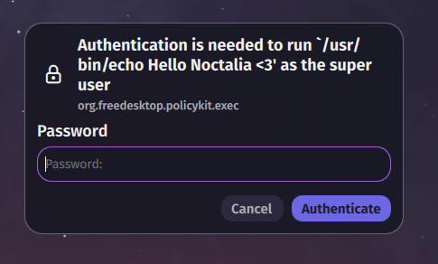

# Polkit Agent

This plugin provides a Polkit authentication agent for Noctalia. It allows you to authenticate actions that require elevated privileges directly within the shell.

## Important

To use this plugin, you **must disable or uninstall your existing polkit authentication agent** (e.g., `polkit-gnome`, `polkit-kde-agent`, `lxpolkit`, etc).

Having multiple polkit agents running simultaneously will cause conflicts and prevent this plugin from working correctly.

> You may need to **restart your session or computer** after enabling this plugin for the changes to take effect and for the new agent to be registered properly.